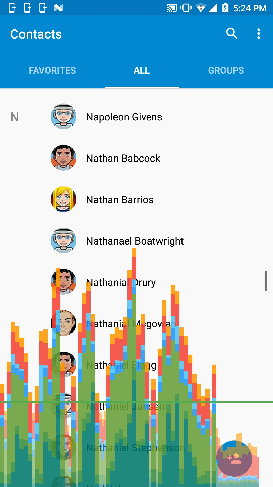
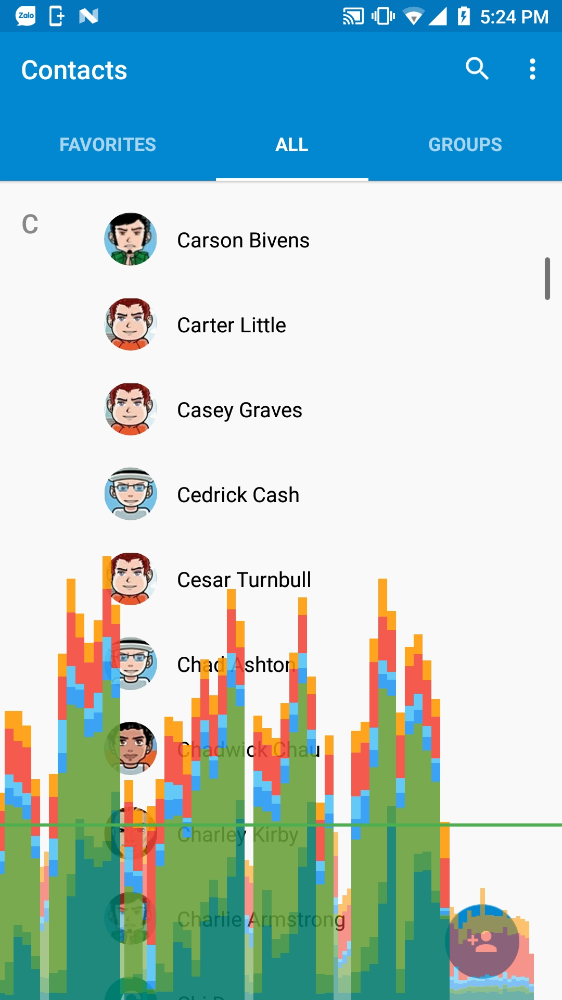
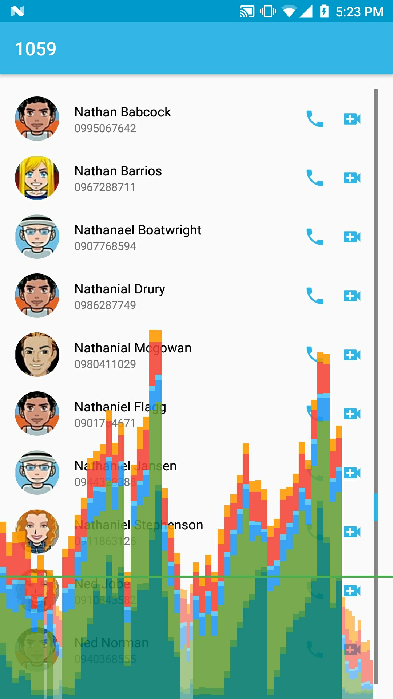
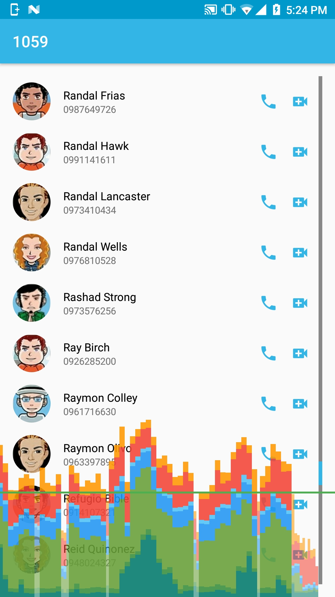

# FastScrollList
A demo application for fast scroll feature of RecyclerView.

## Approaches
This demo consists of 2 approaches
1. The first approach is ported from a library called [LollipopContactsRecyclerViewFastScroller](https://github.com/AndroidDeveloperLB/LollipopContactsRecyclerViewFastScroller). It is simple, lightweight but lacks customization capabilities. More problematically, the xml has to declared one more view beside RecyclerView to achieve the purpose, it could be a little troublesome to modify such code in large codebase.
2. The second approach is a combination of the above-mentioned library and another library called [RecyclerView-FastScroll](https://github.com/timusus/RecyclerView-FastScroll). It not only keeps the simplicity of the original lib but also gains the ability of declaring only one view in xml layout. A considerable drawback is the fact that the drawing process, the bubble for instance, is actually hardcoded and difficult to change.
3. The thrid approach is the default fast scroll feature of RecyclerView. This method does not include the bubble indicates first letter of current view. However, it should be added fairly easily.

## Performance
The goal of this experiment is to create a fast-scroll feature for RecyclerView, without losing the smooth experience of the original RV. In the other hand, the rendering time of each frames should not exceed 16ms, in order to maintain 60fps standard.

Testing with [Profile GPU Rendering](https://developer.android.com/topic/performance/rendering/profile-gpu.html) enabled, the rendering time still depends on the number of contacts: the larger the number of contacts, the higher those frames render. Nevertheless, it should only slightly exceed 16ms for typical situations (< 200) or lose 1 - 2 frames for larger database (~ 1000). In terms of comparing to other major commercial products, it is actually on par with the default contacts application of Android, and far more efficient than the Facebook Messenger application.

Screenshots showing performance difference between the default Contact application and the demo application

## Note
* Keep in mind that this is only a Proof of Concept, **_not a usable library_**.  
* The **_Performance_** section tested mainly with the second approach.
